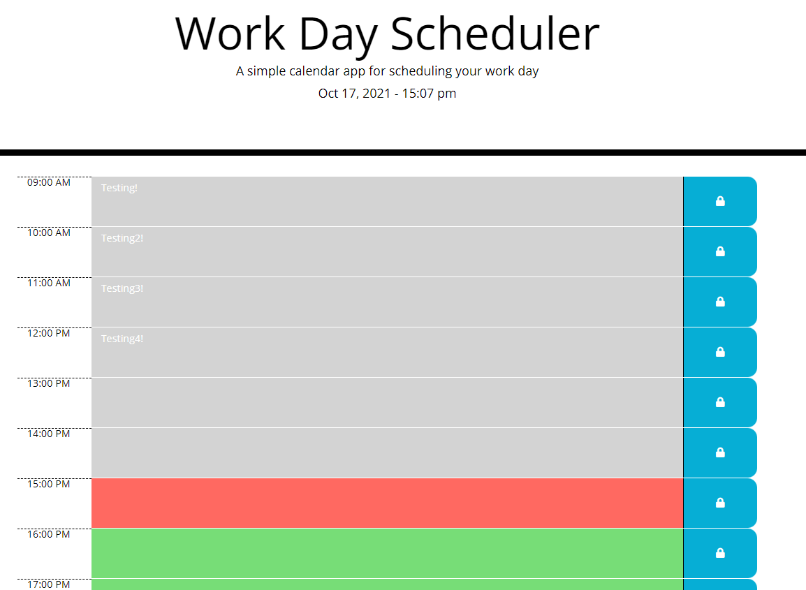

# Work Day Scheduler
## Description

This application is intended to assist the user in storing events for the standard work day on a color-coded calendar.  

## Installation
* None
## Usage
This repository can be opened as an HTML within Github at the website: https://teeemster.github.io/Work-Day-Scheduler/

The user can view the current time of day at the top of the page. The user can click into each row on the scheduler and key hourly events in. If the user would like to save those events for later, they can also click the lock button to solidify those events into the scheduler. The calendar will automatically change colors based on the time of day. The present hour is indicated with a red shaded row, the past hours with a gray shaded rows, and future hours with green shaded rows. 

    
## Credits
* Jonathan Beach
* University of Arizona

## License
* 

## Badges
  
* 
* 
* 